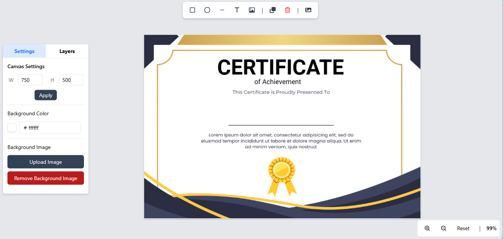

# Pramman-Patra Canvas Editor
[Live Preview](https://pramman-editor-v2.vercel.app/)
<div style="width: 100%;">
  
</div>

**Pramman Canvas Credential Editor** is an intuitive and powerful canvas-based editor designed to create and customize certificates, credentials, and other formal documents with ease. It is part of a larger project aimed at providing a comprehensive platform to manage, create, and distribute certificates efficiently, which is currently under development.

## Getting Started

These instructions will get you a copy of the project up and running on your local machine for development and testing purposes. See deployment for notes on how to deploy the project on a live system.

### Prerequisites
-	[Node.js](https://nodejs.org/en)
-	[pnpm](https://pnpm.io/)

### Development

Clone the repository, install the dependencies and start the application

```
git clone git@github.com:mausam-giri/pramman-canvas-editor.git
cd pramman-canvas-editor
pnpm install
pnpm run dev
```

## Built With

* [Next.js](https://nextjs.org/) - The React Framework
* [Fabric.js](https://fabricjs.com/) - Canvas Library

## Contributing

Please read [CONTRIBUTING.md](CONTRIBUTING.md) for details on our code of conduct, and the process for submitting pull requests to us.

## License

This project is licensed under the GNU License - see the [LICENSE.md](LICENSE.md) file for details

## Acknowledgments

We sincerely appreciate the time and effort of all contributors and issue reporters. Your contributions help us improve the **Canvas Credential Editor** and make it more user-friendly and robust for everyone.

### For Contributors

Thank you for submitting pull requests, enhancing features, fixing bugs, and suggesting improvements. Your input is invaluable in shaping the future of this project.
